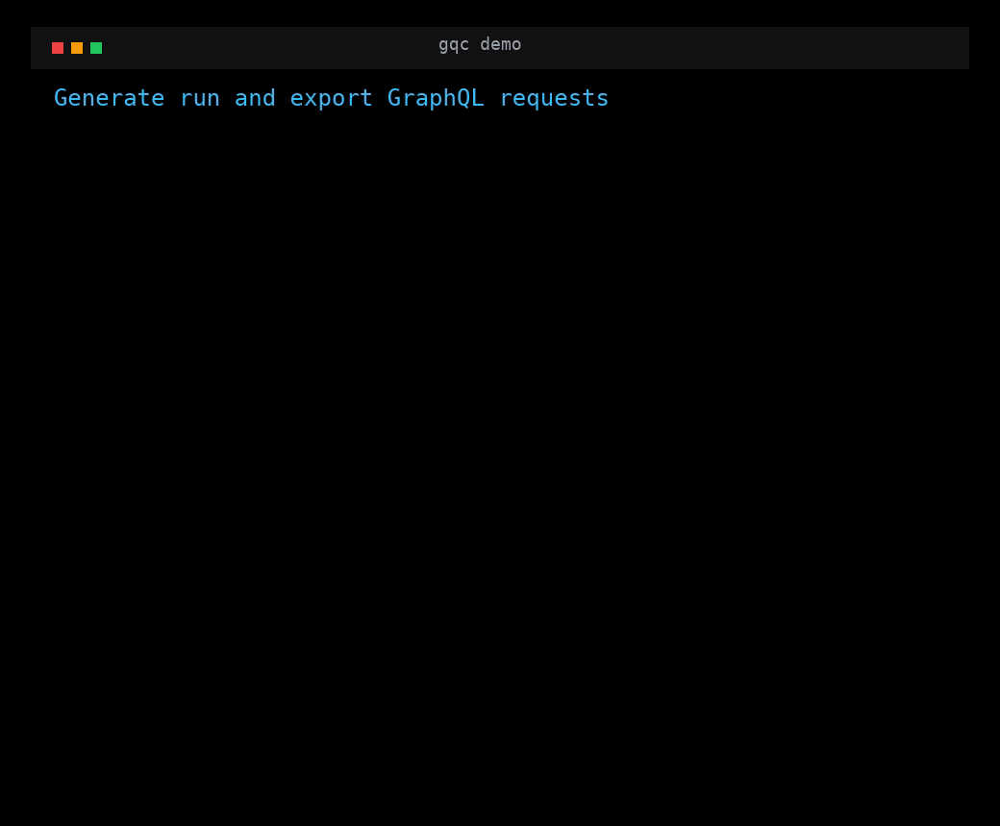

# GraphQL-Curl (`gqc`)

`gqc` is a Go CLI that reads your GraphQL schema and helps you either:

- generate ready-to-run `curl` requests for top-level `query` and `mutation` fields, or
- generate Postman collections for schema operations, or
- execute those generated operations directly against your endpoint.

It also supports schema fetching via GraphQL introspection.

## What's New

- `--interactive` mode to fill variables from a terminal form.
- `--run` mode to execute generated operations immediately.
- Request performance metrics in `--run` mode (Total, TTFB, DNS, TCP, TLS, Size).
- `--filter` support (gjson syntax) to print only part of a response.
- Variables from inline JSON (`--vars`) or JSON file (`--var-file`).
- Copy-friendly output formats for Postman JSON payloads and GraphQL Playground query/variables blocks.
- Postman Collection v2.1 export with folders per schema file and requests per query/mutation.
- Multiple named schemas with separate paths, endpoints, auth tokens, and headers.
- Header interpolation using `{{auth_token}}`, `{{environment.KEY}}`, and `${ENV_VAR}` values.
- Configurable query expansion depth via `environment.MAX_DEPTH`.
- Configurable schema file extensions via `document_extensions`.

## Requirements

- Go `1.25.5` (from `go.mod`).

## Demo



## Install

### Option 1: Install from module

```bash
go install github.com/emp1re/gql-curl/cmd/gqc@latest
```

### Option 2: Build from source

```bash
git clone https://github.com/emp1re/gql-curl
cd gql-curl
go build -o gqc ./cmd/gqc
```

## Quick Start

1. Create `graphql.curl.yaml` in your working directory.
2. Configure one or more entries under `schemas`.
3. Run `gqc generate`.

```bash
gqc generate
```

Generate one operation only:

```bash
gqc generate getUser
```

## Shell Completion

`gqc` can complete command names, flags, configured schema names, and top-level
GraphQL `query`/`mutation` operation names from your local schema.

For the current Bash session:

```bash
source <(gqc completion bash)
```

For Zsh:

```bash
gqc completion zsh > "${fpath[1]}/_gqc"
```

For Fish:

```bash
gqc completion fish > ~/.config/fish/completions/gqc.fish
```

For PowerShell:

```powershell
gqc completion powershell | Out-String | Invoke-Expression
```

After loading completion, operation names are suggested directly in the terminal:

```bash
gqc generate <TAB>
gqc generate --schema main <TAB>
```

## Configuration (`graphql.curl.yaml`)

The CLI loads `graphql.curl.yaml` from the current directory.
It also calls `.env` loading automatically (via `godotenv`).

```yaml
schemas:
  main:
    path: "/gql"
    endpoint: "http://localhost:8080/gql/query"
    auth_token: ${MAIN_AUTH_TOKEN}
    headers:
      Authorization: "Bearer {{auth_token}}"

  api:
    path: "./api/gql/"
    endpoint: "http://api.service:8080/query"
    auth_token: ${API_AUTH_TOKEN}
    headers:
      Authorization: "Bearer {{auth_token}}"
      X-API-Key: ${API_KEY}

document_extensions: [".graphql", ".graphqls", ".gql"]

environment:
  MAX_DEPTH: 3
```

### Field Reference

- `schemas` (map): named GraphQL schema configs. Commands process all schemas by default, or one schema with `--schema <name>`.
- `schemas.<name>.path` (string or []string): local schema file/directory path. `generate` parses matching files from this path. `fetch` writes the fetched schema to this path.
- `schemas.<name>.endpoint` (string): GraphQL server URL for this schema.
- `schemas.<name>.auth_token` (string): optional token value, usually loaded from `${ENV_VAR}` and available in headers as `{{auth_token}}`.
- `schemas.<name>.headers` (map): HTTP headers for generated/executed/fetched requests.
- `document_extensions` ([]string): schema file extensions to parse (for example `.graphql`, `.graphqls`, `.gql`).
- `environment` (map): values used for interpolation and runtime settings (like `MAX_DEPTH`).

## Commands

### `generate`

Generate `curl` commands for all root operations:

```bash
gqc generate
```

Generate for one configured schema:

```bash
gqc generate --schema main || gqc g -s main
```

Generate for one operation:

```bash
gqc generate getUser || gqc g getUser
```

Use inline variables:

```bash
gqc generate getUser --vars '{"id":"123"}' || gqc g getUser --vars '{"id":"123"}'
```

Use variables from file:

```bash
gqc generate getUser --var-file ./vars.json || gqc g getUser --var-file ./vars.json
```

Interactive variable input:

```bash
gqc generate createUser --interactive || gqc g createUser -i
```

Execute request immediately:

```bash
gqc generate getUser --run
```

Execute and filter output (gjson path):

```bash
gqc generate getUser --run --filter 'data.getUser.name'
```

Run with variables and still see performance metrics:

```bash
gqc generate getUser --run --vars '{"id":"123"}'
```

Print a Postman-ready raw JSON body:

```bash
gqc generate getUser --format postman
```

Print separate query and variables blocks for GraphQL Playground:

```bash
gqc generate getUser --format playground
```

> Note: `--vars` and `--var-file` are mutually exclusive.

### `postman`

Generate a Postman Collection v2.1 file for every configured schema:

```bash
gqc postman
```

Generate only one configured schema from `graphql.curl.yaml`:

```bash
gqc postman --schema main
```

Generate only operations declared in one schema file:

```bash
gqc postman --schema main --file center.graphqls
```

Write to a custom collection path:

```bash
gqc postman --schema main --file center.graphqls --out center.postman_collection.json
```

Print the collection JSON to stdout:

```bash
gqc postman --out -
```

The generated collection uses:

- folders named from schema files, for example `center.graphqls`;
- one request per top-level `query` or `mutation` field;
- readable multiline GraphQL queries in each Postman GraphQL body;
- the endpoint URL from `schemas.<name>.endpoint`;
- headers from `schemas.<name>.headers` after `.env`, `${ENV_VAR}`, and `{{auth_token}}` interpolation.

### `fetch`

Fetch every configured schema using introspection and save each result to its `path`:

```bash
gqc fetch
```

Fetch one configured schema:

```bash
gqc fetch --schema main || gqc f -s main
```

If `schemas.<name>.path` points to a directory, output is saved as `schema.graphql` in that directory.

## Generated Output Example

Default `curl` output:

```bash
# Schema: main | Operation: query | Field: getUser
curl -X POST http://localhost:8080/gql/query \
  -H 'Authorization: Bearer <token>' \
  -H 'Content-Type: application/json' \
  --data-raw '{"query":"query getUser($id: ID!) {\n  getUser(id: $id) {\n    id\n    name\n  }\n}","variables":{"id":"<ID>"}}'
```

Postman payload output:

```json
{
  "query": "query getUser($id: ID!) {\n  getUser(id: $id) {\n    id\n    name\n  }\n}",
  "variables": {
    "id": "<ID>"
  }
}
```

Playground output:

```graphql
# Query
query getUser($id: ID!) {
  getUser(id: $id) {
    id
    name
  }
}
```

```json
{
  "id": "<ID>"
}
```

## Runtime Response Behavior (`--run`)

- JSON object/array responses are colorized and pretty-printed.
- With `--filter`, scalar results are printed as raw values (useful for scripts).
- If filtered path does not exist, a warning is shown.

## Metrics

When you use `gqc generate ... --run`, the CLI prints a performance block after the response:

- `Total`: full request time (send request + receive/read response body).
- `TTFB`: time to first byte from the server.
- `DNS`: DNS lookup duration (can be zero on cached/reused connections).
- `TCP`: TCP connect duration (can be zero on keep-alive reuse).
- `TLS`: TLS handshake duration (can be zero for plain HTTP or reused TLS session).
- `Size`: response body size.

Example:

```text
📊 Performance Metrics:
  Total: 123ms  TTFB: 47ms  DNS: 2ms  TCP: 4ms  TLS: 0ms  Size: 3.21 KB
```

This is useful for quick endpoint latency checks without external tooling.

## Help

```bash
gqc
gqc --help
gqc generate --help
gqc postman --help
gqc fetch --help
```

When a command is called with invalid arguments or flags, `gqc` prints the error
followed by the relevant command help. For example, an invalid generate format
prints the `generate` usage, examples, and flags.

## Development

Run without installing:

```bash
go run ./cmd/gqc --help
go run ./cmd/gqc generate --help
go run ./cmd/gqc postman --help
go run ./cmd/gqc fetch --help
```
